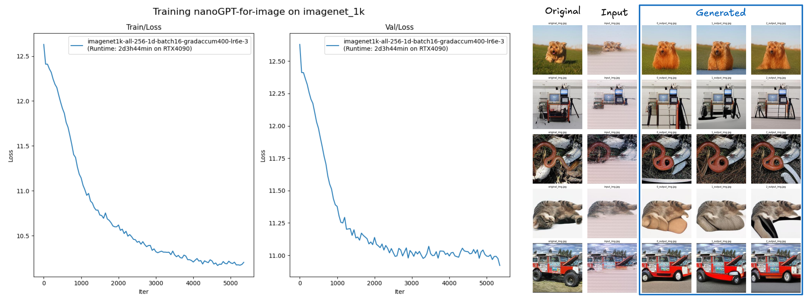
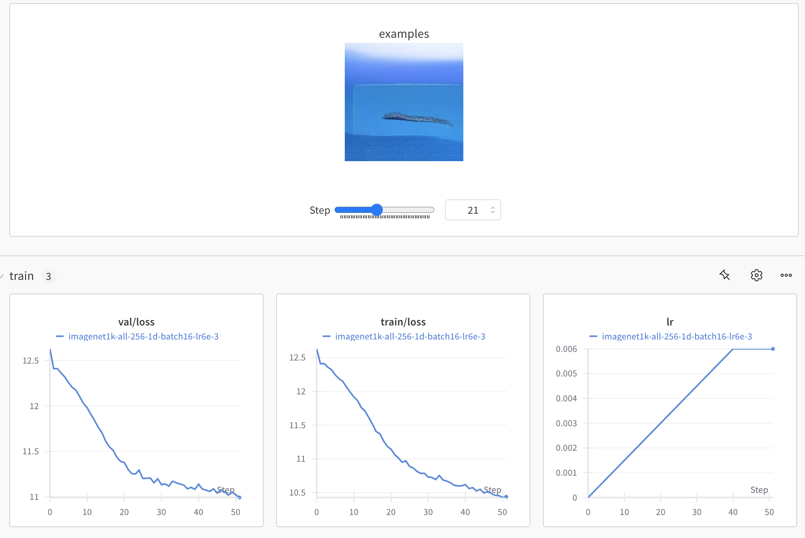
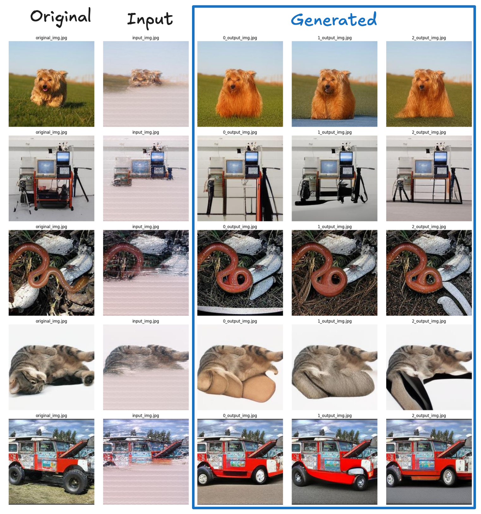

# nanoGPT-for-image

This is a fork of [nanoGPT](https://github.com/karpathy/nanoGPT) adapted to train an image generation model. It adds two datasets (fashion-kaggle and imagenet1k) and wandb logging of generated images during training.

<figure>
    
    <figcaption>nanoGPT-for-image. Training on imagenet1k</figcaption>
</figure>

<figure>
    
    <figcaption>wandb logging during training</figcaption>
</figure>

## install

```
pip install torch numpy transformers datasets tiktoken open_magvit2 wandb tqdm
```

Dependencies:

- [pytorch](https://pytorch.org) <3
- [numpy](https://numpy.org/install/) <3
-  `transformers` for huggingface transformers <3 (to load GPT-2 checkpoints)
-  `datasets` for huggingface datasets <3 (if you want to download + preprocess OpenWebText)
-  `tiktoken` for OpenAI's fast BPE code <3
-  `open_magvit2` for image tokenization
-  `wandb` for optional logging <3
-  `tqdm` for progress bars <3


## Train on imagenet1k

### 1. Prepare training the data into binary file

First, we download [imagenet_1k dataset](https://huggingface.co/datasets/evanarlian/imagenet_1k_resized_256). Then convert from raw images into one large stream of integers (tokenization is done with [Open-MAGVIT2](https://github.com/TencentARC/Open-MAGVIT2/tree/main)):

```sh
python data/imagenet_1k/prepare.py
```

This creates a `train.bin` and `val.bin` in that data directory. 

### 2. Train
Now it is time to train your GPT. Experiments in this repo are done with an RTX4090

```sh
python train.py config/train_imagenet1k.py
```

On one RTX4090 GPU this training run takes about 2 days and the best validation loss is 11.01. The model checkpoints are being written into the `--out_dir` as `out-imagenet1k-all-256-1d-batch16-lr6e-3`. 

### 3. Sample

Once the training finishes we can sample from the best model by pointing the sampling script at this directory:

```sh
python sample_image.py --out_dir=out-imagenet1k-all-256-1d-batch16-lr6e-3
```

This generates a few samples, for example:

<figure>
    
</figure>

### Train on kaggle fashion

### 1. Prepare training the data into binary file
First, download and tokenize the dataset (tokenization is done with [Open-MAGVIT2](https://github.com/TencentARC/Open-MAGVIT2/tree/main)):

```sh
python data/kaggle-fashion/prepare.py
```

This creates a `train.bin`, `val.bin`, `single.bin` (a single image, useful for debugging purposes) in that data directory. 

### 2.Train
Now it is time to train your GPT. Experiments in this repo are done with an RTX4090

```sh
python train.py config/train_fashion_kaggle.py
```

On one RTX4090 GPU overfiting on one image should take one minute.


The model checkpoints are being written into the `--out_dir` as `out-fashion-kaggle`. 

### 3. Sample 

Once the training finishes we can sample from the best model by pointing the sampling script at this directory:

```sh
python sample_image.py --out_dir=out-fashion-kaggle
```
