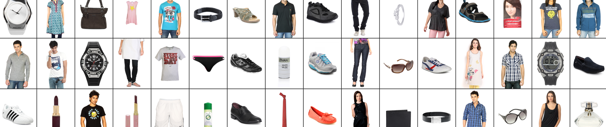

## Kaggle Product Fashion dataset


<p align="center">
    
</p>

<p align="center">
    <em>Figure: Kaggle fashion dataset</em>
</p>

44,444 images of (256,256) pixels in total. The image tokenizer used is [Open-MAGVIT2](https://github.com/TencentARC/Open-MAGVIT2/tree/main). Each 256×256 image is tokenized into 16×16(256) tokens.

After running `prepare.py` (preprocess) we get:

- train.bin is ~79M, val.bin ~8.7M, single.bin 2K (single is a dataset of a single image useful for debugging)
- train has ~10M tokens (10,239,232)
- val has ~1M tokens (1,137,664)
- single has 256 tokens

 References:

- [Fashion Product Images](https://www.kaggle.com/datasets/paramaggarwal/fashion-product-images-dataset) dataset
- [Language Model Beats Diffusion: Tokenizer is key to visual generation](https://magvit.cs.cmu.edu/v2/)
- [Open-MAGVIT2](https://github.com/TencentARC/Open-MAGVIT2/tree/main), [checkpoint 256×256 ImageNet](https://huggingface.co/TencentARC/Open-MAGVIT2/blob/main/imagenet_256_L.ckpt)


## install

For the tokenizer model you need

```bash
pip install open-magvit2
```